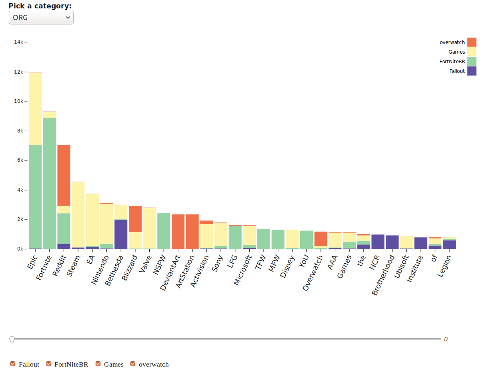
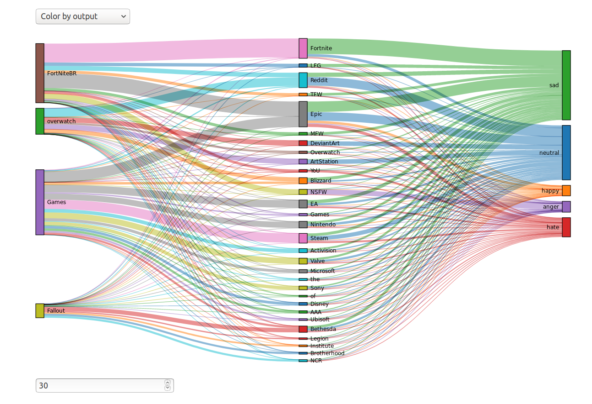
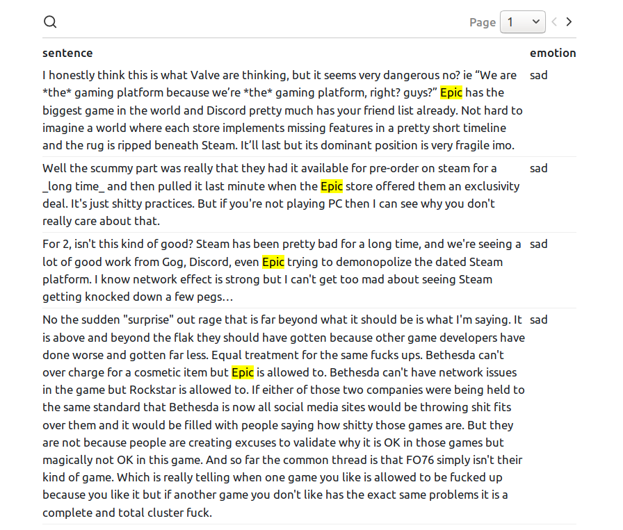

# Reddit Visualization
#### Data extraction and visualization

Tools:
+ BERT language model
+ Obervable javascript notebook
+ reddit dataset: https://bigquery.cloud.google.com/table/fh-bigquery:reddit_comments.2019_01
+ Google colab (optional)

Available Visualizations:
<table>
    <tr>
        <th>Graph</th>
        <th>Extraction method</th>
    </tr>
    <tr>
        <td>Sankey</td>
        <td>Term Sentiment</td>
    </tr>
    <tr>
        <td>Stacked Bar Chart</td>
        <td>Name Entity Recognition</td>
    </tr>
</table>

Observable notebook:
> https://observablehq.com/@sheldonchiu/comp-4462-sankey

  
  
  

